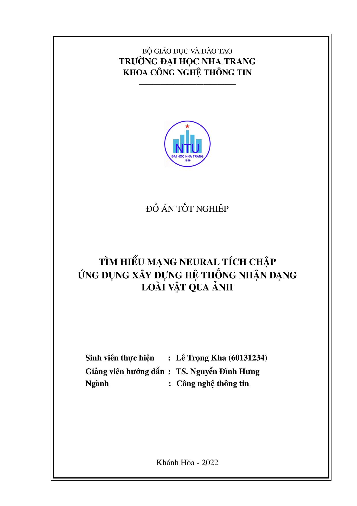

## Mẫu báo cáo đồ án tốt nghiệp

Đây là mẫu báo cáo đồ án tốt nghiệp bằng LaTeX nhằm hỗ trợ học viên/sinh viên soạn thảo báo cáo chuyên nghiệp và thuận tiện hơn. Mẫu báo cáo được định dạng theo quy định của Trường Đại học Nha Trang,

### Sử dụng
Có thể sử dụng template này theo một trong hai cách:
- Soạn thảo trực tuyến trên Overleaf
- Sử dụng phần mềm soạn thảo LaTeX trên máy tính

#### Biên tập trực tuyến trên [Overleaf](https://overleaf.com)
Đây là cách dễ nhất, người dùng chỉ cần sử dụng mẫu báo cáo để biên soạn trực tiếp trên trang Overleaf mà không cần cài đặt gì. Để sử dụng, [chọn mẫu báo cáo này](https://www.overleaf.com/latex/templates/thesis-template-for-nha-trang-university/xmvfdjxwzxtp) để soạn thảo trên Overleaf.

#### Sử dụng phần mềm soạn thảo LaTeX chuyên dụng
Có thể tải mẫu báo cáo về máy tính bằng cách [vào đây](https://github.com/nd-hung/thesis-template), chọn Code -> Download ZIP để tải template về máy tính. 
Sau đó sử dụng phần mềm soạn thảo LaTeX, như [TeXnicCenter](https://www.texniccenter.org/), để biên tập.
